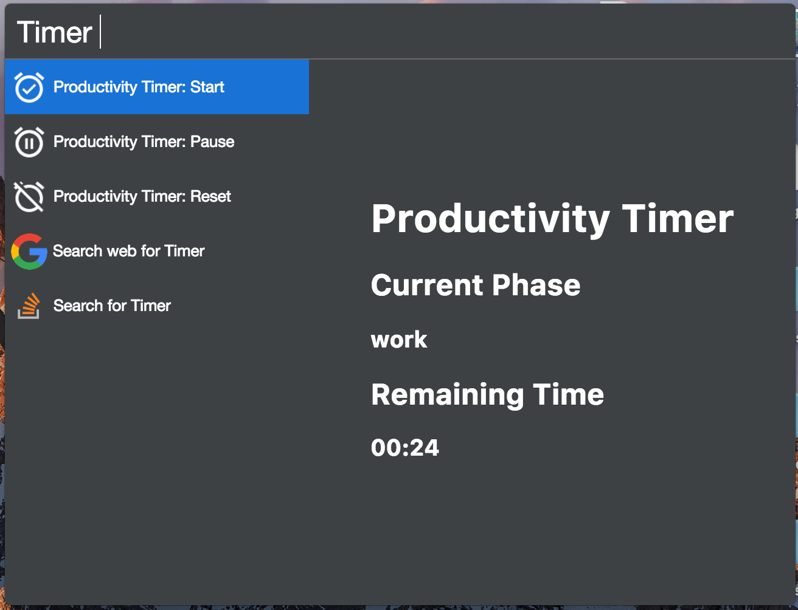

# cerebro-productivity-timer

> [Cerebro](https://cerebroapp.com) plugin to setup a productivity timer.

## Usage

In Cerebro, type `timer` and select the start action. Once the timer is complete a notification will pop up allowing you to start the resting phase when you are ready.

There are also actions to pause and reset the timer.

A few things planned include a nicer interface, and some user configurable settings.
Currently, the settings are 25 mins of work, 5 minutes of rest, and manual continuance (i.e. you must click on the notification, or use the cerebro interface to start the next phase).

I also want to add a small analytics view, like daily streak count, etc.

## Installing

* Type `plugins timer` into Cerebro
* Click `install`

## Related

- [Cerebro](http://github.com/KELiON/cerebro) – main repo for Cerebro app;

## License

MIT © [Matthew Jacobs](https://www.mattjdev.com)
